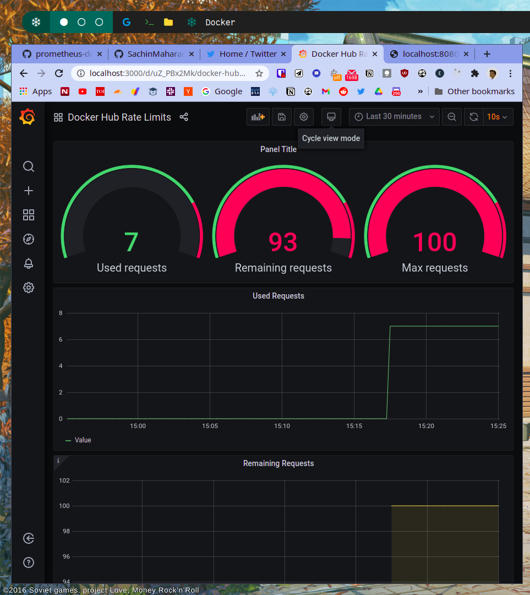

# prometheus-docker-limit-exporter (work in progress)

This exporter(inspired by a gitlab project) allows to retrieve the [Docker Hub rate limit counts ](https://docs.docker.com/docker-hub/download-rate-limit/#how-can-i-check-my-current-rate) counts as scrape target for Prometheus.

The exporter obtains an auth token and then queries the Docker Hub registry with a HEAD request to parse RateLimit-Limit, RateLimit-Remaining and RateLimit-Reset into a Gauge metric.

You can use your Docker Hub credentials to authenticate, or an anonymous token is used.

# Example Usage

```sh
docker-compose up

You can run `docker pull --all-tags busybox` // to see this in action

http://localhost:8080/metrics
http://localhost:3000 // for grafana dashboard

```


